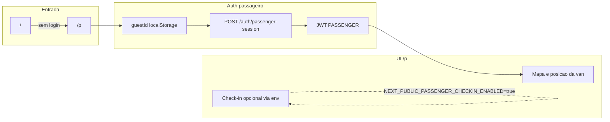

# Plano / resumo: atualizações do passageiro (duas entregas)

Este documento descreve **o que foi implementado** nas duas últimas frentes de trabalho no perfil **passageiro** (`/p`). Pode ser exportado para PDF (Pandoc, impressão do navegador a partir do preview Markdown, ou Word/Google Docs).

---

## 1. Retirar a obrigatoriedade de login (apenas passageiro)

### Objetivo

Permitir uso do app do passageiro **sem** passar pela tela `/login`, mantendo motorista e admin com login obrigatório.

### Motivo técnico

Check-in, viagens e WebSocket exigem **identidade** (`userId` + JWT). A solução foi **sessão anônima**: mesmo mecanismo de token, obtido automaticamente, sem formulário.

### Backend

| Item | Detalhe |
|------|---------|
| Rota | `POST /auth/passenger-session` (pública, sem guard) em `apps/api/src/auth/auth.controller.ts` |
| Lógica | `AuthService.passengerSession` em `apps/api/src/auth/auth.service.ts`: valida `guestId` (UUID v4), email estável `guest_<uuid>@passenger.local`, cria `User` com role `PASSENGER` e nome "Passageiro" se não existir, senha aleatória hasheada (não usada para login por email), JWT com **365 dias** |
| Migração | Nenhuma (reutiliza modelo `User`) |

### Frontend

| Arquivo | Alteração |
|---------|-----------|
| `apps/web/src/lib/auth/passengerSession.ts` | `getOrCreateGuestId` / `clearGuestId` (`localStorage` `dreamdriver_passenger_guest_id`), `ensurePassengerSession()`, `resetPassengerSession()` |
| `apps/web/src/lib/auth/index.ts` e `apps/web/src/lib/auth.ts` | Reexport dos helpers |
| `apps/web/src/app/page.tsx` | Sem sessão → redireciona para **`/p`** em vez de `/login` |
| `apps/web/src/app/p/page.tsx` | Remove `requireAuth` para `/login`; se **ADMIN** ou **DRIVER** já logados, redireciona para `/admin` ou `/d`; caso contrário `ensurePassengerSession()`; passageiro com token existente (ex.: seed) segue normal; botão "Nova sessão" em vez de Perfil/Sair |

### O que **não** mudou

- `apps/web/src/app/d/page.tsx` e `apps/web/src/app/admin/page.tsx` continuam com `requireAuth` e redirect para `/login`.
- API de negócio continua protegida por JWT.

---

## 2. Inativar check-in na UI do passageiro (só acompanhar a van)

### Objetivo

Esconder check-in, lista "Passageiros por ponto" e marcadores derivados de check-ins no mapa; **manter** trajeto da van, status em tempo real e mapa focado na van.

### Abordagem

- Flag de ambiente: **`NEXT_PUBLIC_PASSENGER_CHECKIN_ENABLED`**
- Só com valor **`true`** a UI de check-in volta a aparecer.
- **Padrão** (variável ausente ou diferente de `true`): modo **só acompanhamento** — funções `handleCheckin` / `handleCancelCheckin` e endpoints no backend **permanecem no código**, apenas não são expostas na interface.

### Arquivos

| Arquivo | Alteração |
|---------|-----------|
| `apps/web/src/lib/env.ts` | `isPassengerCheckinEnabled()` → `true` somente se `NEXT_PUBLIC_PASSENGER_CHECKIN_ENABLED === 'true'` |
| `apps/web/src/app/p/page.tsx` | Condiciona blocos de UI, fetch de `/checkins/pickup-points`, estado de check-ins no snapshot/socket e marcadores no `MapView` |
| `.env.example` | Comentário documentando a variável |

### Reativar check-in depois

No `.env` da web:

```env
NEXT_PUBLIC_PASSENGER_CHECKIN_ENABLED=true
```

Reiniciar o servidor Next.js (variáveis `NEXT_PUBLIC_*`).

---

## Fluxo resumido (visão conjunta)



**Leitura em texto:** a raiz `/` envia quem não está logado para `/p`. Em `/p`, o `guestId` no navegador chama `POST /auth/passenger-session` e recebe JWT de passageiro. Com esse token a UI mostra o mapa e a posição da van; o bloco de check-in só aparece se a variável de ambiente acima estiver como `true`.

---

## Como gerar PDF a partir deste arquivo

1. **Pandoc** (se instalado): na raiz do repositório, `pandoc docs/passageiro-atualizacoes.md -o docs/passageiro-atualizacoes.pdf`
2. **VS Code / Cursor**: abrir o preview Markdown e usar **Imprimir** → **Salvar como PDF**
3. **Word / Google Docs**: colar o conteúdo e exportar como PDF
